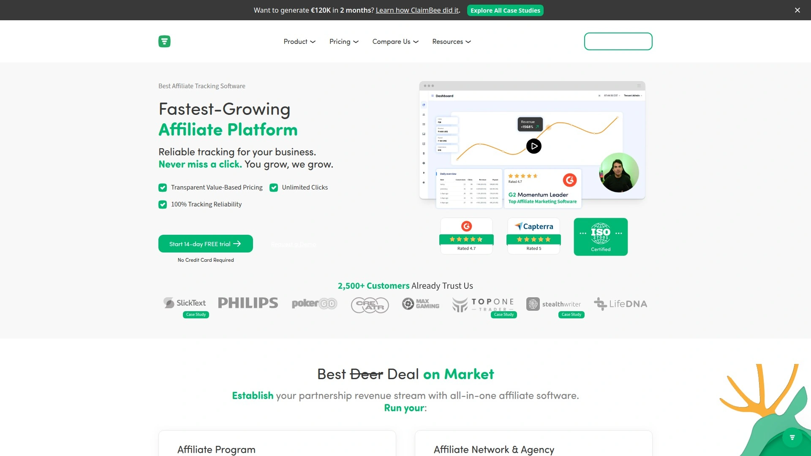
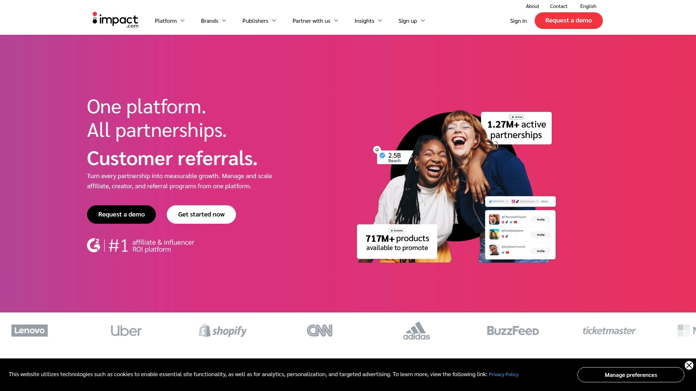
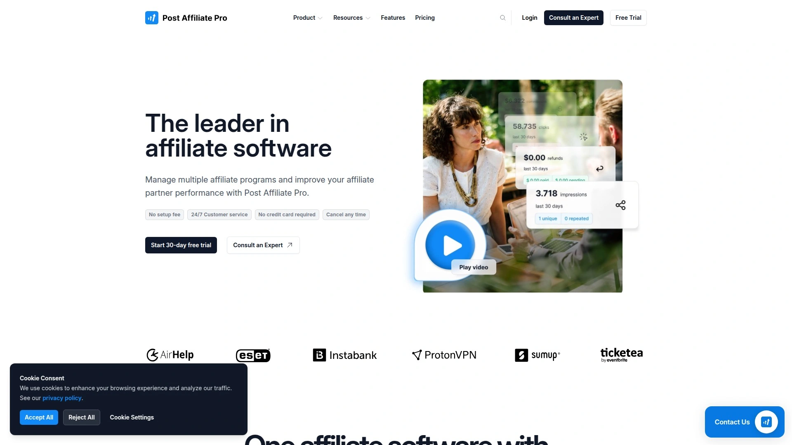
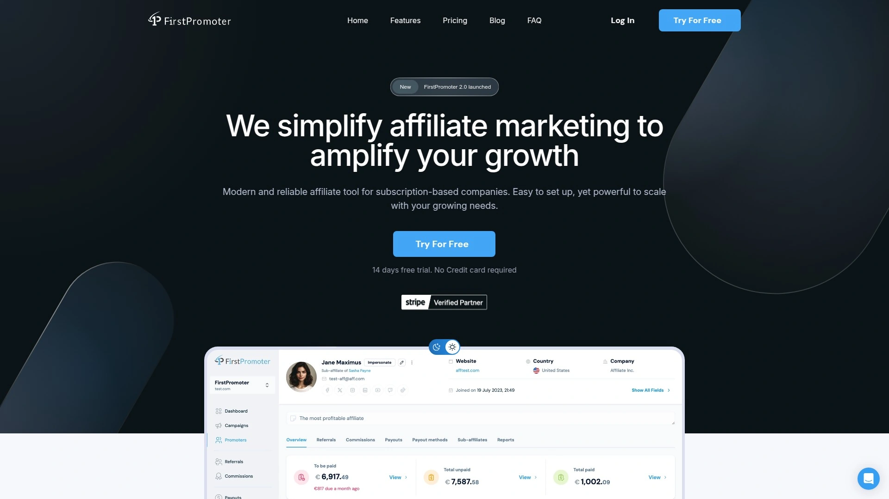
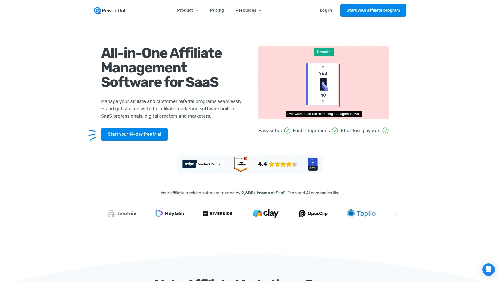
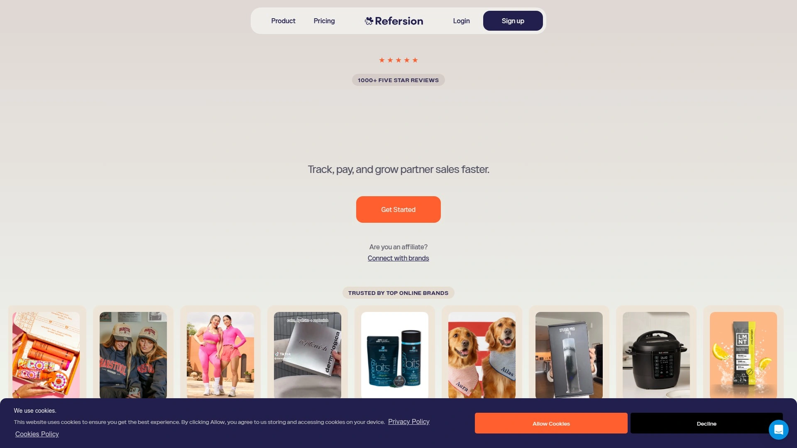
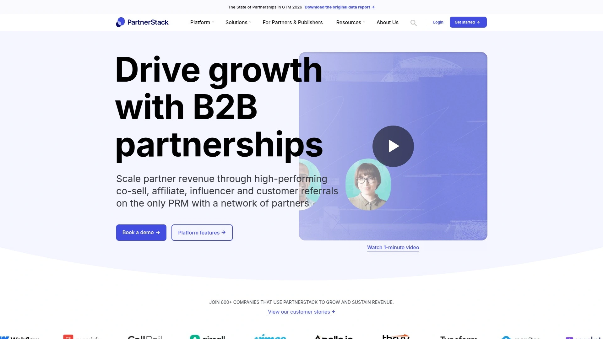
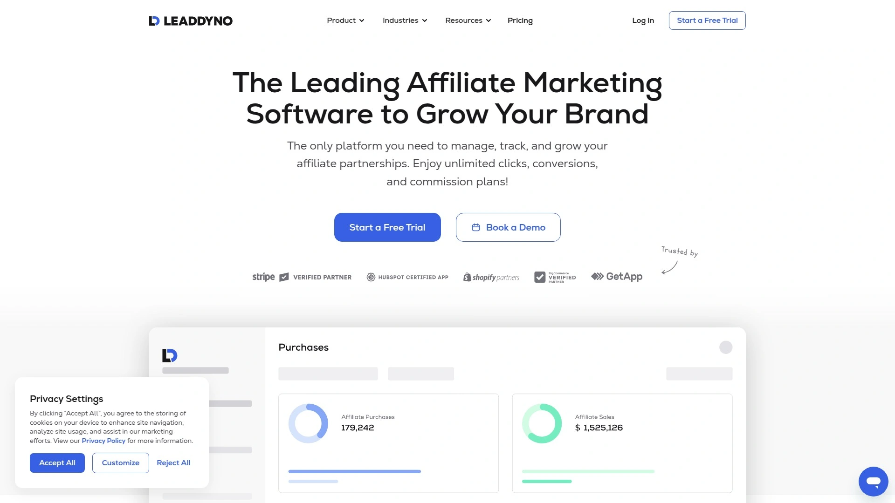

# 2025's Top 12 Best Partnership Tracking Tools

Finding the right platform to monitor performance and manage partner relationships can transform how businesses scale. Whether you're coordinating with external collaborators, tracking link clicks, or automating payments, the right software simplifies operations and delivers clear visibility into what's working. This guide explores twelve platforms that excel at tracking, analytics, and relationship management—helping you choose the solution that fits your workflow and growth goals.

---

## **[Trackdesk](https://trackdesk.com)**

All-in-one platform for reliable click tracking and partnership analytics with 100% uptime guarantee.

Trackdesk stands out for its comprehensive approach to managing business partnerships through technology. The platform runs on Google Cloud infrastructure across multiple geographic locations, ensuring consistent availability and data integrity. Real-time analytics provide instant visibility into link performance, conversion patterns, and partner activity across all campaigns.

The payment automation system supports multiple methods including PayPal, Wise, Tipalti, and bank transfers, with cryptocurrency options like BTC and ETH. This flexibility makes global payment distribution straightforward, reducing administrative overhead significantly. The bulk payout feature processes multiple transactions simultaneously, saving approximately 30 minutes daily for active users.

Trackdesk's reporting capabilities allow users to build custom dashboards, segment data by various parameters, and access detailed error logs. The platform handles unlimited clicks, conversions, and partner accounts without imposing volume restrictions. Integration options span major ecommerce platforms, payment processors, and marketing tools, creating a unified ecosystem for performance management.

For businesses transitioning from other systems, Trackdesk provides full migration support with zero downtime. The expert team handles data transfer, system configuration, and partner onboarding to ensure smooth transitions. The value-based pricing model scales with business growth rather than penalizing success with usage caps.

---

## **[Partnero](https://www.partnero.com)**

Modern partnership management with white-label customization and newsletter integration capabilities.

Partnero delivers a flexible platform centered on partner experience and engagement. The white-label portal allows complete branding customization, creating a seamless extension of your business identity. Partners interact with dashboards, resources, and reporting tools that reflect your brand rather than generic software interfaces.

The commission structure options include dynamic calculations, product-based variations, and goal-based rewards. Store credits and gift card systems provide alternative incentive mechanisms beyond traditional cash payments. Multi-currency handling ensures international partners receive appropriate payment formats without manual conversion.

Integration capabilities cover Shopify, WooCommerce, Paddle, and Stripe, connecting directly to major business platforms. The newsletter component enables partners to share content through email channels, expanding reach through trusted relationships. Automated onboarding sequences guide new partners through setup and best practices.

Real-time analytics track performance across all partnership types, providing transparency for both administrators and partners. The pricing structure starts at $49 monthly with a 30-day trial period requiring no credit card, making it accessible for growing businesses.

***

## **[Impact.com](https://impact.com)**

Enterprise-grade platform with extensive partner marketplace and multi-channel attribution capabilities.

Impact.com operates at enterprise scale, managing complex partnership ecosystems across multiple channels and partner types. The platform's marketplace connects businesses with over 250,000 vetted potential collaborators, streamlining partner discovery and recruitment. Cookieless tracking technology provides accurate attribution without relying on browser cookies, adapting to evolving privacy standards.

Multi-touch attribution maps the complete customer journey across touchpoints, revealing how different interactions contribute to conversions. This visibility enables data-driven decisions about partner value and resource allocation. Contract management automation reduces legal overhead by standardizing agreements and tracking compliance requirements.

The platform handles influencer partnerships, content creators, traditional link partners, and strategic business relationships through a unified interface. Automated workflows manage repetitive tasks like approval processes, payment scheduling, and performance notifications. Expert support teams assist with strategic planning and optimization beyond basic technical implementation.

Pricing begins at $30 monthly or 3% of tracked revenue, whichever proves higher, with tiered plans scaling to $2,500+ for advanced features. The flexible model accommodates different business sizes and growth stages.

***

## **[Tapfiliate](https://tapfiliate.com)**

User-friendly tracking solution with in-platform messaging and unlimited partner capacity.

Tapfiliate emphasizes simplicity without sacrificing functionality, making it accessible for teams without technical expertise. The platform supports unlimited partners across all pricing tiers, eliminating growth restrictions as programs expand. In-platform messaging enables direct communication between program managers and partners without external email systems.

Flexible payment structures accommodate various business models including cost-per-sale, cost-per-action, and cost-per-lead arrangements. Recurring calculations ensure subscription businesses properly attribute ongoing value. The fraud detection system monitors suspicious patterns like self-clicks, bot traffic, and unusual conversion timing.

Social media integration allows partners to share branded content across platforms with embedded tracking parameters. The banner management system provides creative assets that partners can access and deploy directly from their dashboards. Custom signup fields capture relevant information during partner application processes.

Integration options span ecommerce platforms, payment processors, CRM systems, and marketing automation tools. Multi-language support includes Spanish, broadening accessibility for international programs. The Essential plan starts at $89 monthly following a 14-day trial period, with Pro and Enterprise tiers adding advanced customization.

***

## **[Everflow](https://www.everflow.io)**

Advanced multi-channel platform with sophisticated fraud prevention and attribution modeling.

Everflow targets businesses running complex, multi-channel performance initiatives requiring granular tracking capabilities. The platform captures engagement actions beyond basic conversions, including newsletter signups, webinar registrations, app installs, and repeat purchases. This comprehensive event tracking reveals the full customer journey across touchpoints.

Multi-touch attribution models distribute value across the path to conversion, accurately reflecting each partner's contribution. The fraud detection algorithms analyze traffic patterns, device fingerprints, and behavioral signals to identify suspicious activity. Customizable partner portals provide branded experiences tailored to different partner segments.

The API enables deep technical integrations for businesses requiring custom implementations. Real-time reporting provides instant visibility into campaign performance across all channels simultaneously. The platform handles agencies, influencers, traditional link partners, and paid advertising channels through unified tracking.

Pricing starts at $750 monthly with a six-month commitment, positioning Everflow as a solution for established programs with substantial scale. The Core plan includes essential features, while Enterprise plans offer complete customization.

***

## **[Post Affiliate Pro](https://www.postaffiliatepro.com)**

Comprehensive tracking software with multi-tier structures and 24/7 support availability.

Post Affiliate Pro delivers extensive features for businesses managing complex partner hierarchies. Multi-tier structures enable partners to recruit sub-partners, creating network effects that accelerate program growth. The platform tracks activity across multiple levels, calculating appropriate distributions automatically.

Fraud protection mechanisms monitor for duplicate conversions, cookie stuffing, and traffic quality issues. Automated workflows handle routine tasks like approval notifications, performance alerts, and payment reminders. The asset library stores marketing materials including banners, text links, and promotional content that partners can access on-demand.

Integration capabilities span major ecommerce platforms, though implementation may require more technical configuration compared to simpler alternatives. The software supports various tracking methods including pixels, postback URLs, and server-to-server connections. Customization options allow businesses to tailor the interface and functionality to specific requirements.

Support includes 24/7 live chat and phone assistance, providing help across time zones. The Pro plan begins at $129 monthly following a 30-day trial, with Ultimate and Network tiers scaling to $599 for advanced features.

***

## **[FirstPromoter](https://firstpromoter.com)**

Subscription-focused platform with automated payment processing and SEO-friendly link structures.

FirstPromoter specializes in subscription businesses requiring recurring calculation capabilities. The platform automatically tracks ongoing subscriptions, adjusting values when upgrades, downgrades, or cancellations occur. This ensures accurate attribution across customer lifecycles rather than only initial conversions.

The customizable dashboard provides partners with performance insights, earnings visibility, and promotional resources. SEO-friendly link structures avoid generic tracking parameters, creating cleaner URLs that partners prefer sharing. Coupon tracking associates specific discount codes with individual partners for attribution.

Multi-tiered structures enable partners to earn from sub-partner activity, creating network effects. The fraud prevention system monitors for self-referrals and suspicious patterns. Automated payments through Stripe, PayPal, and other processors reduce manual work for program administrators.

Integration focuses on SaaS payment platforms including Stripe, Paddle, and Chargebee, with API access for custom connections. The Starter plan begins at $49 monthly with a 14-day trial, scaling to $149 for Enterprise features including advanced customization.

***

## **[Rewardful](https://www.rewardful.com)**

Stripe-focused solution with simple setup and flexible incentive structures.

Rewardful streamlines setup for Stripe-powered businesses through native integration requiring minimal configuration. The platform emphasizes ease of use, enabling non-technical teams to launch tracking programs quickly. Recurring calculations ensure subscription value attribution continues beyond initial sign-ups.

The custom portal provides partners with branded dashboards displaying performance metrics, earnings, and available resources. API access enables developers to build custom integrations when standard connections don't meet specific requirements. Multi-currency support accommodates international partners without manual conversion.

Payment automation connects directly to Stripe, triggering distributions based on configurable rules. The platform handles various incentive structures including fixed amounts, percentage-based calculations, and hybrid models. Real-time analytics provide visibility into link performance, conversion rates, and revenue generation.

Integration primarily serves Stripe users, though connections to other payment processors exist. The Starter plan begins at $49 monthly with a $7,500 monthly revenue limit, scaling to $99 for Growth (up to $15,000) and $149+ for Enterprise.

***

## **[Affise](https://affise.com)**

Mobile-first platform with international focus and transparent pricing structure.

Affise combines partnership management with mobile attribution capabilities, serving businesses with app-based components. The mobile-first tracking captures in-app events, installs, and post-install activity across iOS and Android platforms. This makes it suitable for companies with both web and mobile presence.

The platform emphasizes international scalability with multi-currency support and global payment options. Transparent pricing starts at $89 monthly, avoiding the custom quote model many enterprise platforms require. Migration tools facilitate transitions from legacy systems with minimal disruption.

Real-time analytics provide instant visibility into campaign performance across channels and geographies. The API enables custom integrations for businesses with unique technical requirements. Fraud detection monitors for bot traffic, click injection, and other mobile-specific threats.

Workflow automation handles repetitive administrative tasks, freeing teams to focus on strategy and optimization. The platform supports various tracking methodologies including pixel-based, server-to-server, and SDK implementations. Reporting capabilities include customizable dashboards with relevant metrics for different stakeholder groups.

***

## **[Refersion](https://www.refersion.com)**

Ecommerce-specialized platform with straightforward implementation and unlimited partner access.

Refersion targets ecommerce businesses specifically, with optimized integrations for Shopify, BigCommerce, and WooCommerce. The platform provides unlimited partner capacity across all pricing tiers, supporting program growth without tier upgrades. Setup processes emphasize speed, enabling non-technical teams to launch quickly.

The customizable portal gives partners access to performance data, promotional assets, and payment information. Multi-channel attribution tracks conversions across different touchpoints including social media, email, and direct links. Campaign management tools organize initiatives by timeframe, product category, or partner segment.

Automated payment processing connects with PayPal for streamlined distributions. The platform handles various calculation methods including flat-rate, percentage-based, and product-specific structures. Real-time reporting provides visibility into key metrics like click-through rates, conversion percentages, and average order values.

However, monthly conversion limits apply to each pricing tier—Starter allows 10 conversions, Professional handles 50, and Business supports 200 before requiring Enterprise custom pricing. The Starter plan begins at $79 monthly with a 14-day trial period.

***

## **[PartnerStack](https://partnerstack.com)**

SaaS-focused ecosystem platform with marketplace access and collaborative tools.

PartnerStack specializes in software partnerships, providing tools tailored to SaaS business models and go-to-market strategies. The marketplace connects businesses with potential partners already familiar with software sales and implementation. This curated network accelerates partner recruitment compared to building from scratch.

The platform handles various partnership types including resellers, technology integrations, and strategic alliances through unified management. Collaborative tools facilitate communication, resource sharing, and joint planning between companies and their partners. Automated workflows manage routine tasks like agreement signing, training completion, and performance reviews.

Integration capabilities connect with major SaaS platforms including billing systems, CRMs, and marketing automation tools. The reporting dashboard provides visibility into partnership pipeline, active collaborations, and performance metrics. Scalability features support complex partnership hierarchies as programs mature.

Pricing begins at $500+ monthly, positioning PartnerStack as an enterprise solution for established software companies. The investment reflects comprehensive features and marketplace access, though it may exceed budgets for early-stage businesses.

***

## **[LeadDyno](https://www.leaddyno.com)**

Ecommerce-integrated platform with mobile management and cryptocurrency payment options.

LeadDyno emphasizes ecommerce integration with over 25 native connections including Shopify, BigCommerce, and PayPal. The mobile app enables program management from smartphones, providing flexibility for administrators working remotely. Cryptocurrency payment options including Bitcoin offer alternatives to traditional banking.

The recruitment system helps identify and onboard new partners through various channels. Automated lead management tracks prospects through the funnel from initial interest to conversion. Mass payment capabilities process multiple distributions simultaneously through PayPal and Wise.

Analytics and reporting provide visibility into partner performance, conversion patterns, and revenue generation. Email marketing automation keeps partners informed about new products, promotions, and performance updates. The platform handles various calculation structures based on product categories, customer lifetime value, or flat rates.

However, overage fees apply when traffic exceeds plan limits at $0.10 per additional visitor, potentially increasing costs as programs grow. The Lite plan starts at $49 monthly with limitations, scaling through Essential ($129), Advanced ($349), and Unlimited ($749) tiers.

***

## FAQ

**How do partnership tracking platforms measure performance accuracy?**

Modern platforms use multiple tracking methodologies including pixel-based tracking, server-to-server connections, and first-party data capture. Real-time synchronization with payment processors ensures conversions match actual transactions. Most enterprise solutions maintain 99.9%+ uptime guarantees hosted on cloud infrastructure, minimizing data loss from technical issues.

**What integration capabilities should businesses prioritize?**

Focus on native connections to your existing ecommerce platform, payment processor, and CRM system. API access enables custom integrations for unique requirements. Consider platforms supporting both pixel and server-side tracking for redundancy. Multi-currency handling becomes critical for international operations, while mobile SDK support matters for app-based businesses.

**How can teams evaluate platform scalability before committing?**

Review pricing structures for volume restrictions on clicks, conversions, or partner counts. Unlimited models prevent unexpected costs as programs grow. Test migration support offerings if transitioning from existing systems. Examine whether advanced features require tier upgrades or remain accessible across plans, affecting long-term total cost of ownership.

---

## Conclusion

Choosing the right partnership tracking platform depends on your business model, technical requirements, and growth trajectory. For businesses seeking reliable infrastructure with transparent pricing and unlimited scalability, [Trackdesk](https://trackdesk.com) delivers exceptional value through its 100% uptime guarantee, comprehensive analytics, and flexible payment options. The platform's migration support and expert assistance make transitions seamless, while value-based pricing aligns costs with actual business growth rather than penalizing success with volume restrictions.
